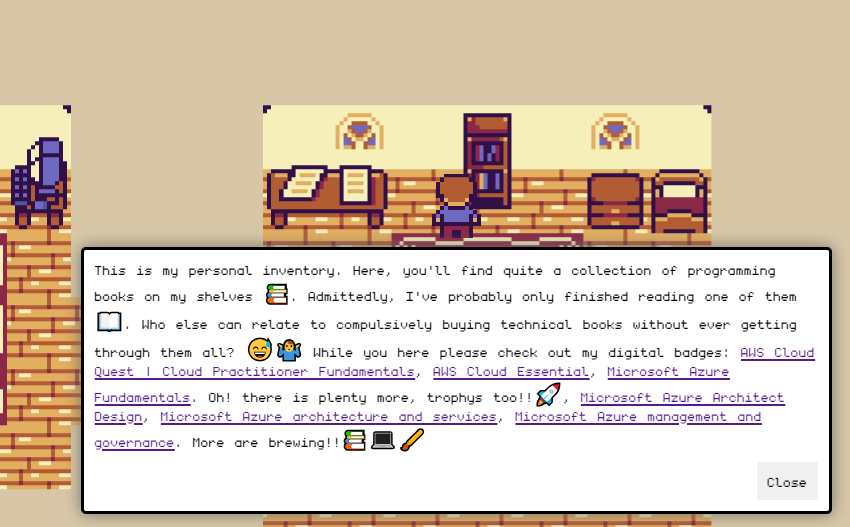

# Developer portfolio | 2D Game.

Inspired by the many creative 3D developer portfolios, I create one that's 2D instead.
This is meant as a template that you can use to build your own. It works on both desktop
and mobile.

# About the Project

This developer portfolio is not just a showcase of my skills, but also a fun 2D game experience! Navigate through different sections of my portfolio while enjoying an engaging game environment.

# Features

Interactive Navigation: Move through your portfolio sections using intuitive controls.
Customizable: Easily customize the content and design to match your personal style.
Responsive Design: Ensures a consistent experience across various screen sizes and devices.
Optimized Performance: Built with performance in mind to ensure fast loading times.

# How to run

Note: You need `Node.js` and `npm` installed on your machine.

`npm install` then `npm run dev`

# How to build

`npm run build` and a dist folder should be created.

# How to preview the build

`npm run preview`

# How to host?

Once the project is built. Take the content of the dist folder and drag and drop it
to your favorite static site hosting provider.
